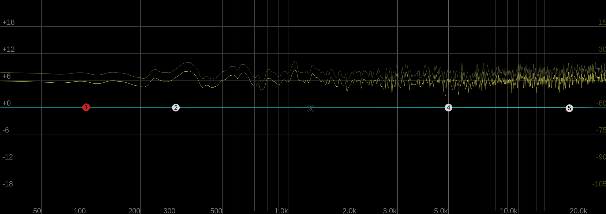
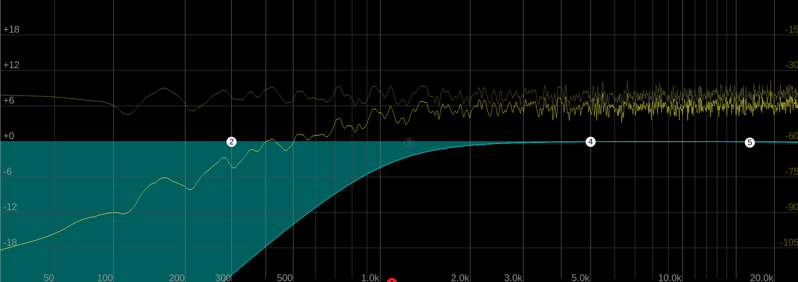
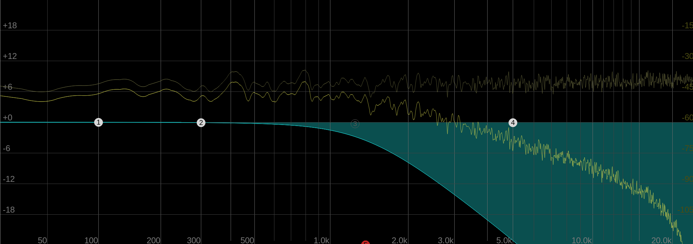
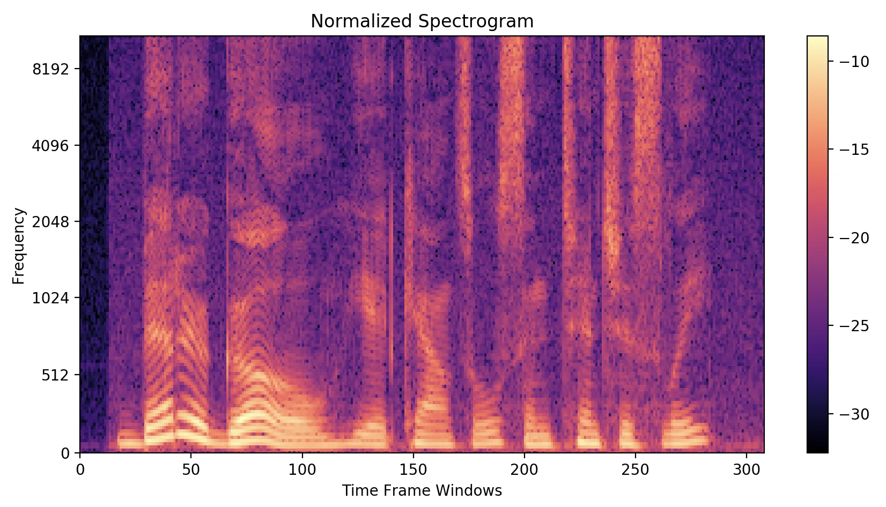

# Audio 

What can you do to audio? <!-- .element: class="fragment" -->

What can you do with audio? <!-- .element: class="fragment" -->

How is audio stored and transmitted? <!-- .element: class="fragment" -->

---

# Frequency 

1. EQ

---

## White noise

All frequencies equally.

<audio controls> 
    <source src="assets/noise.wav" type="audio/wav">
</audio>

Lets filter some of these away <!-- .element: class="fragment" -->

---

## High pass filter

<audio controls>
    <source src="assets/high_pass.wav" type="audio/wav">
</audio>

---

## Low pass filter

<audio controls>
    <source src="assets/low_pass.wav" type="audio/wav">
</audio>

---

## Band pass filter

<audio controls>
    <source src="assets/band_pass.wav" type="audio/wav">
</audio>

---

## Fouier transform

`$$ \hat{f} (\xi)=\int_{-\infty}^{\infty}f(x)e^{-2\pi ix\xi}dx $$`

But what is that good for? <!-- .element: class="fragment" -->

---

## Spectrogram

---

## EQ visualisation

---

## Noise removal

Noisy recording: 

<audio controls>
    <source src="assets/noisey_vox.wav" type="audio/wav">
</audio>

Cleaned recording

<audio controls> <source src="assets/cleaned_vox.wav" type="audio/wav"> </audio>

Where might this be used? <!-- .element: class="fragment" -->

---

Fourier Transform is also used to speed up other processes

Impulse Response Reverb is one such example <!-- .element: class="fragment" -->

<audio controls>
    <source src="assets/ir_reverb.wav" type="audio/wav">
</audio><!-- .element: class="fragment" -->

[See Openair IR for more for more](https://www.openair.hosted.york.ac.uk/) <!-- .element: class="fragment" -->

---

Frequency information can be used to figure out what the important frequencies are,
and remove those that might have less impact,
thereby reducing file size.

This technique is also used in imagine processing, notably in JPEG files. <!-- .element: class="fragment" -->

---

 

[The Scientist and Engineer's Guide to Digital Signal Processing](https://www.dspguide.com/ch27/6.htm)

---

# Lossless
# Lossy

---

### Tomaso Albinoni (1671-1751): Op.2
### MP3

| bit rate | file | fileSize |
| :---- | :----: | --------: |
| 128kbps | <audio controls> <source src="assets/albinoni_full.mp3" type="audio/mp3"> </audio> | 5.1MB |
| 40kbps  | <audio controls> <source src="assets/albinoni_40.mp3" type="audio/mp3"> </audio>   | 1.6MB |
| 32kbps  | <audio controls> <source src="assets/albinoni_32.mp3" type="audio/mp3"> </audio>   | 1.3MB |
| 16kbps  | <audio controls> <source src="assets/albinoni_16.mp3" type="audio/mp3"> </audio>   | 650KB |
| 8kbps   | <audio controls> <source src="assets/albinoni_8.mp3" type="audio/mp3"> </audio>    | 327KB |

---

### OGG Opus lets us go lower...

| bit rate | file | fileSize |
| :---- | :----: | --------: |
| 4kbps   | <audio controls> <source src="assets/albinoni_opus_4.opus" type="audio/mp3"> </audio>  | 500KB |

... but note the file size <!-- .element: class="fragment" -->

---

What type of compression is used is very important, and each has their own intended use.

---

Opus is a popular streaming format used primarily for voice by Discord, WhatsApp and many others.

First hear a WAV file, then an MP3 and 16kbps, and finally Opus at 16kbps. <!-- .element: class="fragment" -->
<audio controls>
    <source src="assets/Test_mp3_opus_16kbps.wav" type="audio/wav">
</audio><!-- .element: class="fragment" -->

---

Thank you!

<audio controls> <source src="assets/albinoni_8.mp3" type="audio/mp3"> </audio>
